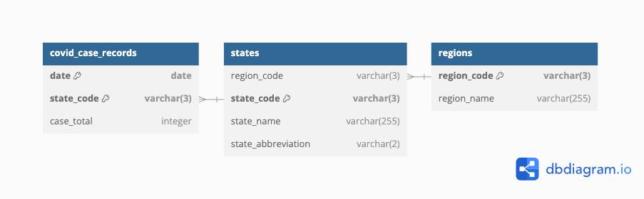

# Compito Rapsodoo - Aron Winkler

Questo documento contiene un breve riassunto delle scelte principali effettuate per lo sviluppo della webapp.
Una versione live del progetto è disponibile al link https://rapsodoo.aronwinkler.com

## Stack

### Front-end: React + TanStack Router

Ho scelto React per familiarità e per la disponibilità di un ottimo componente `Table` nella libreria [Ant Design](https://ant.design/).
Era fondamentale avere un componente versatile e potente per questa parte, dato che si tratta della parte centrale dell'applicazione.

Un router non era tecnicamente necessario considerate le richieste della consegna, ma ho voluto affiancare alla tabella anche un grafico che mostrasse l'andamento dei casi nel tempo, cosa per cui era conveniente creare una nuova pagina.
Per garantire un'esperienza di navigazione fluida, e anche per esperimentare su come funziona (ho usato solo [React Router](https://reactrouter.com/) finora), ho quindi introdotto [TanStack Router](https://tanstack.com/router/latest).

### Back-end: Flask + Celery + Gunicorn

Per dimostrare di avere almeno capacità fondamentali nello sviluppo Python, ho scelto Flask come server HTTP.

A Flask ho poi affiancato Celery, un'implementazione di task queue che volevo usare in primis per l'esportazione dei dati in XML, un processo potenzialmente lungo e oneroso che rischia di bloccare il worker di Gunicorn (il server WSGI usato in produzione) per un tempo eccessivo.

Non ho usato nessun ORM per interfacciarmi con il database relazionale, in parte perchè le relazioni coinvolte nel task non sono molto articolate, e in parte per imparare quanto più possibile sul funzionamento del DB da questa esperienza. Le astrazioni di un ORM avrebbero indebolito queste lezioni.

### DB: PostgreSQL + Redis

Il database principale utilizzato dall'applicazione è Postgres. I records riguardanti i dati COVID vivono qui.

Al DB relazionale ho affiancato anche un'istanza di Redis, che non è usata direttamente nell'applicazione (anche se questa sarebbe una valida strada per uno sviluppo futuro), ma è necessaria per Celery e per il rate limiting applicato sul back-end.

### Import dei dati

Per l'import dei dati, ho scritto uno script separato rispetto al back-end. Nel mondo NodeJS, con il quale ho molta familiarità, i dati sarebbero semplicemente stati importati all'avvio del server HTTP, dato che è molto facile scrivere codice non bloccante in JS.

Non così in Python: per evitare di bloccare i worker di Gunicorn in partenza (nel caso Gunicorn creasse dinamicamente nuovi worker per rispondere alle richieste in arrivo) creando così dei lunghi cold start, ho preferito staccare l'import dei dati completamente dalla logica server.

In questo modo i worker rimangono liberi di rispondere alle richieste con pochissima latenza.

### Ambiente: Docker

Sia in sviluppo che in produzione, tutti i servizi sono eseguti tramite Docker Compose. Questo rende molto facile l'affiancamento di servizi secondo la necessità, e rende il deployment piuttosto snello e portatile.

Nella versione finale, la webapp è composta dai seguenti container:

- Front-end in modalità SPA tramite nginx
- Certbot per il provisioning dei certificati per permettere il protocollo HTTPS
- Back-end che accetta le connessioni tramite il container nginx (vedi `src/front-end/nginx.conf`)
- Celery
- PostgreSQL
- Redis
- Contenitore che esegue la routine di import dati definita nel back-end

## Organizzazione DB

Ho eseguito una parziale normalizzazione dei dati di arrivo, approdando a queste 3 tabelle per l'import dell'andamento COVID:

## Tasks 1-4

### Import dei dati

Come anticipato, l'import dei dati avviene tramite uno script python, eseguito in isolamento in un container dedicato.

Lo script effettua una verifica sul numero di righe in DB contro quelle nel CSV in arrivo, ed esegue l'import se sono riscontrate righe nuove. Non vengono modificati in questo caso i record già esistenti in DB (individuati dalla combinazione data + codice provincia, che fanno da primary key della tabella).

### Visualizzazione tabellare dei dati

Per ottenere questa visualizzazione, il ruolo del BE è ridotto all'esposizione dei dati per provincia, senza quindi un'aggregazione per regione già nel server. Oltre a questo, il BE è responsabile del filtraggio dei dati per data, e del calcolo della variazione dei casi di giorno in giorno (più dettagli su questo nella sezione 'Extras').

Il ruolo relativamente minore del BE permette invece maggior flessibilità di rappresentazione sul FE, dove avviele la maggior parte del lavoro. Il front-end organizza la tabella aggregando per regione e applicando l'ordinamento come da consegna, ma la disponbilità dei dati per provincia permette l'inserimento di una sotto-tabella per regione, dove sono visibili i casi per provincia (vedi le righe espandibili della tabella in https://rapsodoo.aronwinkler.com).

Il FE permette qui anche il libero ordinamento sia dei dati regionali, che quelli relativi alle singole province. Anche il filtraggio dei dati per data è consentita tramite apposito selettore, come da consegna.

Si noti anche che la tabella mostra di default i dati più recenti, e nel selettore è possibile selezionare rapidamente la data più vecchia e quella più recente, laddove sono disponibili dati.

### Export dei dati in XLSX

La generazione del file XLSX avviene tramite la libreria [openpyxl](https://openpyxl.readthedocs.io/en/stable/). Come anticipato, invece di generare il file durante il ciclo di richiesta, la chiamata API esposta per questo scopo aggiunge un nuovo record al task queue gestito da Celery, e ritorna quindi il corrispettivo task_id.

A questo punto, l'utente vedrà un'indicazione di caricamento finchè Celery non avrà completato la generazione del file. Completata l'esecuzione del task, il file XLSX viene scritto su disco in una cartella nota ad nginx, ed è liberamente scaricabile.

Per evitare di riempire il disco, e per limitare l'esposizione ad agenti con cattive intenzioni, il BE genera i dati solo una volta per ciascuna data: se un file per lo stesso timestamp fosse già presente, verrebbe semplicemente usato questo come ritorno della chiamata.

## Extras

### Colonna delta

Nella visualizzazione tabellare, oltre al totale dei casi per un dato giorno, viene indicata anche la variazione rispetto al giorno precedente.
Mi sembrava che la tabella non fosse completa senza questa informazione.

Il delta giornaliero è calcolato direttamente nel DB internamente alla query SQL che scarica i dati relativi alle province, con attenzione a non calcolarlo per tutte le righe presenti, ma solo per la data interessata dalla query dell'utente.

### Visualizzazione line chart

Ho aggiunto una visualizzazione a grafico, per poter vedere l'evoluzione del numero di casi nel tempo, declinati per regione. Oltre alla visualizzazione del totale secco, è anche possibile normalizzare i valori per il totale dei casi nel report più recente. Abilitando questa opzione, tutti i valori riguardanti la Lombardia, per esempio, verrebbero divisi per 4390225, che è il numero di casi osservati al 11/12/2024, la data più recente al momento di stesura di questo testo.

Questo perchè, eccetto per i primi mesi di pandemia, il gran totale dei casi dipende più dalla popolazione della regione, che non da quanto l'area fosse interessata dal virus. Di conseguenza, più si va avanti nel tempo, meno le regioni sono comparabili tra di loro, rendendo necessaria una qualche forma di normalizzazione.

## Autocritica

Per questioni di tempo, non ho aggiunto unit test nè al client nè al server. Avendo un monte ore limitato da dedicare a questo compito, ho preferito investirlo nell'ottenimento di una webapp completa e coerente, accompagnata da questa writeup.

In secondo luogo, avrei potuto commentare in modo più completo il codice del progetto, esplicitando alcune decisioni prese a livello di codice. Se non altro, per questo punto, la divisione del codice in funzioni ordinate con nomi autodescrittivi dovrebbe mitigare la scarsa presenza di commenti.
